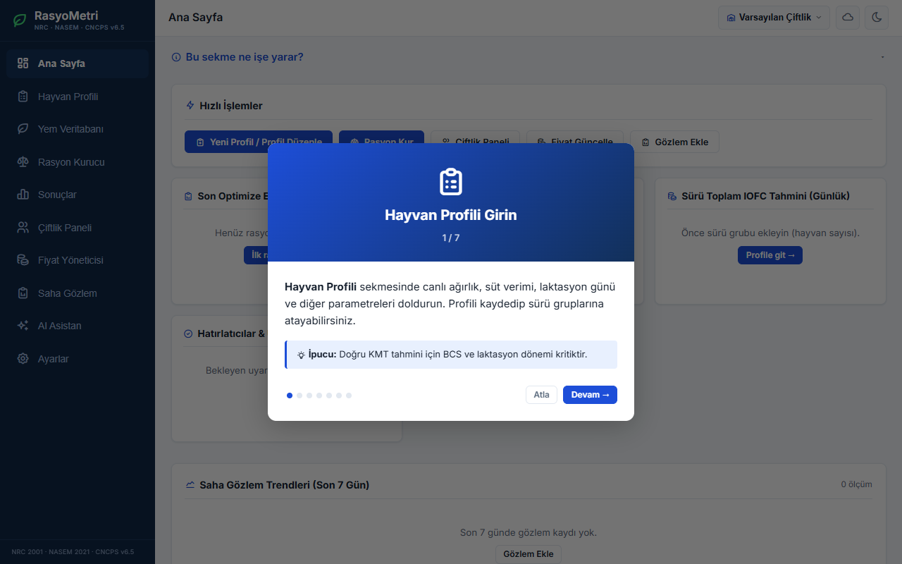
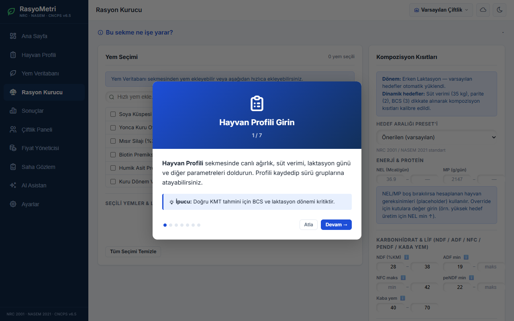
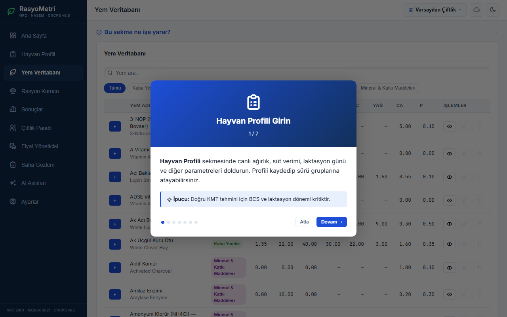
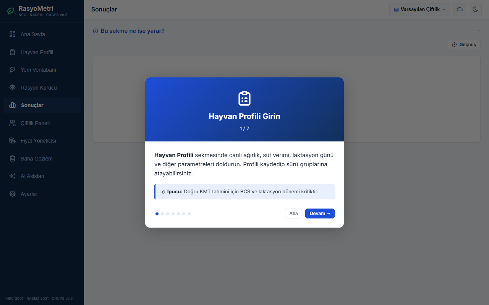

<div align="center">

# 🐄 RasyoMetri

### Gelişmiş Rasyon Optimizasyon Sistemi

**Süt sığırları için NRC 2001, NASEM 2021 ve CNCPS v6.5 tabanlı,  
çevrimdışı çalışabilen, modern rasyon hazırlama programı.**

[](https://developer.mozilla.org/en-US/docs/Web/JavaScript)
[](https://vitejs.dev/)
[](https://supabase.com)
[](https://vercel.com)
[](https://web.dev/progressive-web-apps)

**[🌐 Canlı Demo →](https://rasyon-program.vercel.app)**

</div>

---

## 📸 Ekran Görüntüleri

<table>
  <tr>
    <td align="center"><b>🏠 Ana Sayfa</b></td>
    <td align="center"><b>⚖️ Rasyon Kurucu</b></td>
  </tr>
  <tr>
    <td></td>
    <td></td>
  </tr>
  <tr>
    <td align="center"><b>🌾 Yem Veritabanı</b></td>
    <td align="center"><b>📊 Sonuçlar & Raporlar</b></td>
  </tr>
  <tr>
    <td></td>
    <td></td>
  </tr>
</table>

---

## ✨ Özellikler

### 🧬 Gelişmiş Optimizasyon Modelleri
- NRC 2001, NASEM 2021 ve CNCPS v6.5 standartlarına göre bilimsel hesaplama
- Doğrusal programlama (Linear Programming) ile minimum maliyetli rasyon çözümleri

### 🐄 Hayvan & Sürü Yönetimi
- Laktasyon durumu, süt verimi ve canlı ağırlık gibi parametrelerin detaylı takibi
- Çiftlik paneli üzerinden sürü bazlı değerlendirmeler ve kondisyon takibi
- Saha gözlem modülü (Dışkı puanı, kondisyon puanı)

### 🌾 Yem & Maliyet Yöneticisi
- Besin madde analizleriyle detaylandırılmış özelleştirilebilir geniş yem deposu
- Yem fiyatlarının güncel takibi ve maliyet optimizasyonu
- En ekonomik rasyonun otomatik oluşturulması

### 🤖 AI Asistan
- Rasyon hazırlarken ve verileri yorumlarken anında destek
- Hayvan besleme konularında entegre yapay zeka danışmanlığı

### 📈 Raporlama & Analiz
- Rasyon sonuçlarını ve besin madde yeterliliklerini grafiklerle görüntüleme
- Gelişmiş tasarıma sahip (renklendirme, zebra deseni, sabit başlıklar) Excel çıktıları
- Profesyonel PDF raporları oluşturma ve dışa aktarma

---

## 🏗️ Mimari

```text
RasyoMetri
├── Offline-First (IndexedDB / idb)
│   └── İnternet bağlantısı olmadan sahada kesintisiz çalışma
├── Bulut Senkronizasyon (Supabase)
│   └── Cihazlar arası anında eşitleme ve güvenli yedekleme
├── Çoklu Dil Desteği (i18n)
│   └── Türkçe ve İngilizce arayüz
└── PWA (Progressive Web App)
    └── iOS, Android ve Masaüstü cihazlara uygulama gibi kurulum
```

---

## 🛠️ Teknoloji Yığını

| Katman | Teknoloji |
|--------|-----------|
| **Frontend** | Vanilla JavaScript (ES6+), HTML5, CSS3, Vite |
| **İkonlar** | Tabler Icons |
| **Optimizasyon Motoru** | glpk.js |
| **Grafikler** | Chart.js |
| **Yerel Veritabanı** | IndexedDB (`idb`) |
| **Backend & Auth** | Supabase (PostgreSQL + Auth) |
| **Güvenlik & Parser** | marked, dompurify |
| **PDF & Excel** | jsPDF, jspdf-autotable, xlsx-js-style |
| **PWA & Deploy** | vite-plugin-pwa, Vercel |
| **Test** | Vitest |

---

## 🚀 Kurulum

### Ön Koşullar
- Node.js (v18 veya üzeri)
- Supabase hesabı (Bulut özellikleri için)
- AI API Anahtarı (Asistan için)

### 1. Projeyi Klonlayın
```bash
git clone https://github.com/KULLANICI_ADINIZ/Rasyon-Program.git
cd Rasyon-Program/rasyon-app
```

### 2. Bağımlılıkları Yükleyin
```bash
npm install
```

### 3. Ortam Değişkenlerini Ayarlayın
Ana dizindeki `.env` dosyasını yapılandırarak Supabase ve AI API anahtarlarınızı ekleyin:
```env
VITE_SUPABASE_URL=https://xxxxx.supabase.co
VITE_SUPABASE_ANON_KEY=your_anon_key
VITE_AI_API_KEY=your_ai_key
```

### 4. Uygulamayı Başlatın
```bash
npm run dev
```

Uygulama `http://localhost:5173` adresinde çalışacaktır. Üretim (Production) derlemesi için `npm run build` komutunu kullanabilirsiniz.

### 5. Testleri Çalıştırma
Uygulamanın hesaplama algoritmalarını test etmek için:
```bash
npm run test
# İzleme modunda çalıştırmak için: npm run test:watch
```

---

## 📱 PWA Kurulumu

RasyoMetri, internet tarayıcınız üzerinden tüm cihazlara yerel uygulama gibi kurulabilir:

- **iOS:** Safari → Paylaş → Ana Ekrana Ekle
- **Android:** Chrome → Menü → Uygulamayı Yükle
- **Windows/Mac:** Chrome adres çubuğundaki yükle ikonuna tıklayın

---

## 📄 Lisans & İletişim

Bu proje özel kullanım amaçlıdır. Tüm hakları saklıdır.  
Katkıda bulunmak veya hata bildirmek için GitHub üzerinden *Issue* açabilirsiniz.

---

<div align="center">
  <sub>🐄 RasyoMetri — Bilimsel Besleme, Akıllı Optimizasyon</sub>
</div>
